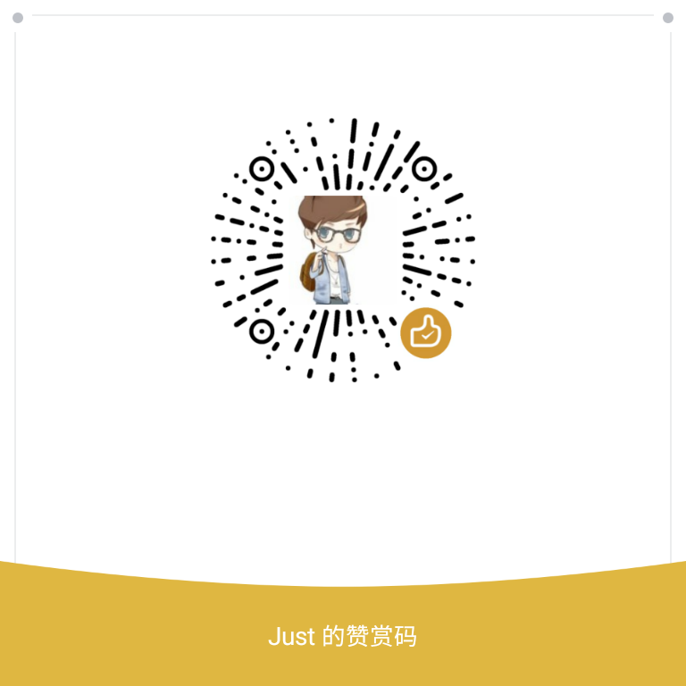

<div style="display: flex;flex-direction: row;justify-content: center" width="100%">
      </img>
</div>

## AgentWeb 介绍

AgentWeb 是一个基于的 Android WebView ，极度容易使用以及功能强大的库，提供了 Android WebView 一系列的问题解决方案 ，并且轻量和极度灵活，详细使用请参照上面的 Sample 。
	

## Gradle 引入

```groovy
allprojects {
	repositories {
		...
		maven { url 'https://jitpack.io' }
	}
}
```


* Androidx

   ```groovy
    implementation 'com.github.Justson.AgentWeb:agentweb-core:v5.0.6-androidx' // (必选)
    implementation 'com.github.Justson.AgentWeb:agentweb-filechooser:v5.0.6-androidx' // (可选)
    implementation 'com.github.Justson:Downloader:v5.0.4-androidx'
   
   ```


## 相关
* [flying-pigeon跨进程IPC组件](https://github.com/Justson/flying-pigeon)
* [AgentWebX5](https://github.com/Justson/AgentWebX5)
* [WebView 进度条](https://github.com/Justson/CoolIndicator)
* [Downloader 一个轻量的文件下载器](https://github.com/Justson/Downloader)

	


## 注意事项
* 支付宝使用需要引入支付宝SDK ，并在项目中依赖 ， 微信支付不需要做任何操作。
* AgentWeb 内部使用了 `AlertDialog` 需要依赖 `AppCompat` 主题 。 
* `setAgentWebParent` 不支持  `ConstraintLayout` 。
* `mAgentWeb.getWebLifeCycle().onPause();`会暂停应用内所有`WebView` 。
* `minSdkVersion` 低于等于16以下自定义`WebView`请注意与 `JS` 之间通信安全。


## 文档帮助
* [Wiki](https://github.com/Justson/AgentWeb/wiki)(不全)
* `Sample`(推荐，详细) 
* [更新日志](./releasenote.md)


## 有问题或者有更好的建议
* [![QQ0Group][qq0groupsvg]][qq0group]
* 欢迎提 [Issues](https://github.com/Justson/AgentWeb/issues)


## 赞赏
开源不易，你的支持是我更新的动力。

<a href="img/alipay.jpg"></a> <a href="img/wechat_pay.jpg"></a> <a href="img/alipay.jpg"></a>


[licensesvg]: https://img.shields.io/badge/License-Apache--2.0-brightgreen.svg
[license]: https://github.com/Justson/AgentWeb/blob/master/LICENSE

[qq0groupsvg]: https://img.shields.io/badge/QQ群-599471474-fba7f9.svg
[qq0group]: http://qm.qq.com/cgi-bin/qm/qr?k=KpyfInzI2nr-Lh4StG0oh68GpbcD0vMG

 

[![License][licensesvg]][license]

## License 
```
Copyright (C)  Justson(https://github.com/Justson/AgentWeb)

Licensed under the Apache License, Version 2.0 (the "License");
you may not use this file except in compliance with the License.
You may obtain a copy of the License at

     http://www.apache.org/licenses/LICENSE-2.0

Unless required by applicable law or agreed to in writing, software
distributed under the License is distributed on an "AS IS" BASIS,
WITHOUT WARRANTIES OR CONDITIONS OF ANY KIND, either express or implied.
See the License for the specific language governing permissions and
limitations under the License.
```

​	

​	  


