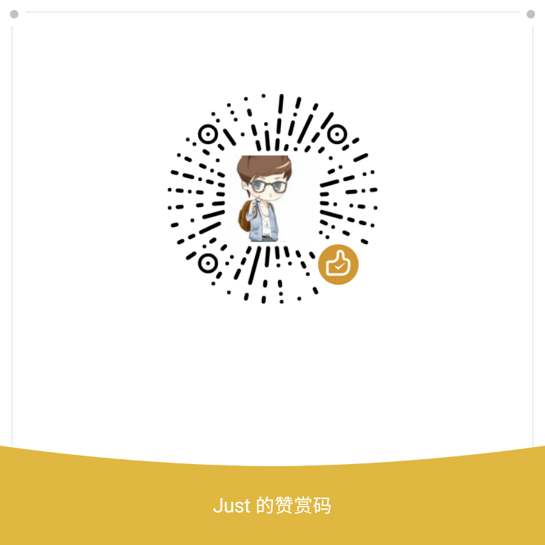

<div style="display: flex;flex-direction: row;justify-content: center" width="100%">
      </img>
</div>

## AgentWeb 介绍

AgentWeb 是一个基于的 Android WebView ，极度容易使用以及功能强大的库，提供了 Android WebView 一系列的问题解决方案 ，并且轻量和极度灵活，详细使用请参照上面的 Sample 。
	

## Gradle 引入

AgentWeb 通过 [JitPack](https://jitpack.io/#Justson/AgentWeb) 分发，请先添加 JitPack 仓库：

```groovy
allprojects {
  repositories {
    mavenCentral()
    maven { url 'https://jitpack.io' }
  }
}
```

Gradle 7+ 若使用 `settings.gradle` 集中管理仓库，则加在 `dependencyResolutionManagement` 中：

```groovy
dependencyResolutionManagement {
    repositories {
        mavenCentral()
        maven { url 'https://jitpack.io' }
    }
}
```

* Androidx

   ```groovy
    implementation 'com.github.Justson.AgentWeb:agentweb-core:5.1.6-androidx' // (必选)
    implementation 'com.github.Justson.AgentWeb:agentweb-filechooser:5.1.6-androidx' // (可选)
    implementation 'com.github.Justson:Downloader:v5.0.6-androidx' // (可选)
   
   ```

> 注意版本号**不带 `v` 前缀**：Git tag 是 `v5.1.6-androidx`，而 JitPack 在生成坐标时会去掉前导 `v`，因此依赖里应写 `5.1.6-androidx`。


## 相关
* [flying-pigeon跨进程IPC组件](https://github.com/Justson/flying-pigeon)
* [AgentWebX5](https://github.com/Justson/AgentWebX5)
* [WebView 进度条](https://github.com/Justson/CoolIndicator)
* [Downloader 一个轻量的文件下载器](https://github.com/Justson/Downloader)

	


## 注意事项
* 支付宝使用需要引入支付宝SDK ，并在项目中依赖 ， 微信支付不需要做任何操作。
* AgentWeb 内部使用了 `AlertDialog` 需要依赖 `AppCompat` 主题 。 
* `setAgentWebParent` 不支持  `ConstraintLayout` 。
* `mAgentWeb.getWebLifeCycle().onPause();`会暂停应用内所有`WebView` 。
* `minSdkVersion` 低于等于16以下自定义`WebView`请注意与 `JS` 之间通信安全。
* v5.1.2 起 `compileSdk` / `targetSdk` 升级到 36（Android 16），Android Gradle Plugin 升级到 8.13.2，请同步升级项目的 Gradle 与 AGP 版本。
* v5.1.3 起库已随包下发 `@JavascriptInterface` 的 keep 规则，接入方**无需**再在自己的 `proguard-rules.pro` 中重复声明。
* **不要直接对 WebView 调用 `setWebViewClient()` / `setWebChromeClient()`**。这会整体替换掉 AgentWeb 内部的实现，进度条、错误页、文件选择等功能都会随之失效。正确做法是使用 `AgentWeb.with(...)` 的 `setWebViewClient()` / `setWebChromeClient()`，或用 `MiddlewareWebClientBase` / `MiddlewareWebChromeBase` 中间件叠加。
* `setOpenOtherPageWays(ASK)` 只在**目标 App 已安装**时才会弹窗询问。未安装时系统中没有任何组件能处理该 scheme，不会弹窗，属预期行为。
* AgentWeb 在处理非 `http/https` 的 scheme 跳转时会调用 `queryIntentActivities` 判断能否唤起其他 App，应用市场的隐私检测可能将其识别为「读取已安装应用列表」。若无需唤起外部 App，设置 `setOpenOtherPageWays(DefaultWebClient.OpenOtherPageWays.DISALLOW)` 即可完全不触发该调用。


## 文档帮助
* [Wiki](https://github.com/Justson/AgentWeb/wiki)(不全)
* `Sample`(推荐，详细) 
* [更新日志](./releasenote.md)


## 有问题或者有更好的建议
* [![QQ0Group][qq0groupsvg]][qq0group]
* 欢迎提 [Issues](https://github.com/Justson/AgentWeb/issues)


## 赞赏
开源不易，你的支持是我更新的动力。

<a href="img/alipay.jpg"></a> <a href="img/wechat_pay.jpg"></a> <a href="img/alipay.jpg"></a>


[licensesvg]: https://img.shields.io/badge/License-Apache--2.0-brightgreen.svg
[license]: https://github.com/Justson/AgentWeb/blob/master/LICENSE

[qq0groupsvg]: https://img.shields.io/badge/QQ群-599471474-fba7f9.svg
[qq0group]: http://qm.qq.com/cgi-bin/qm/qr?k=KpyfInzI2nr-Lh4StG0oh68GpbcD0vMG

 

[![License][licensesvg]][license]

## License 
```
Copyright (C)  Justson(https://github.com/Justson/AgentWeb)

Licensed under the Apache License, Version 2.0 (the "License");
you may not use this file except in compliance with the License.
You may obtain a copy of the License at

     http://www.apache.org/licenses/LICENSE-2.0

Unless required by applicable law or agreed to in writing, software
distributed under the License is distributed on an "AS IS" BASIS,
WITHOUT WARRANTIES OR CONDITIONS OF ANY KIND, either express or implied.
See the License for the specific language governing permissions and
limitations under the License.
```

​	

​	  


