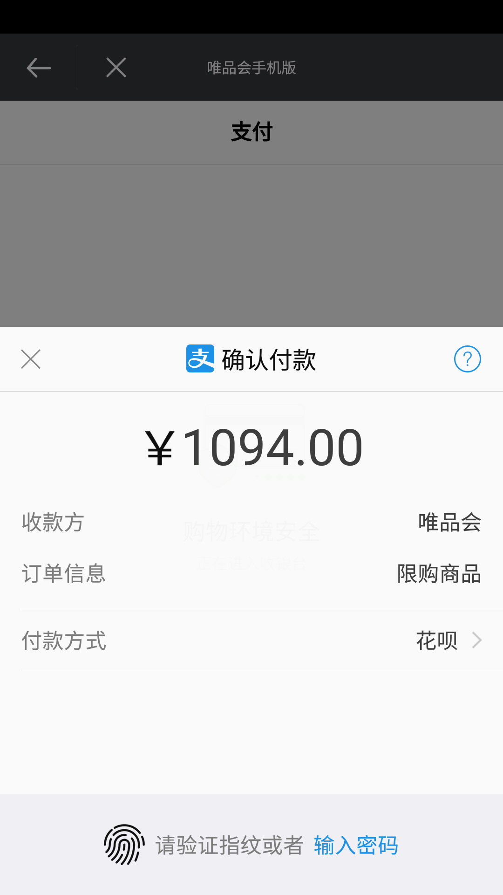

## Introduction to AgentWeb

AgentWeb is a highly encapsulated Android WebView, easy to use, with a progress bar, support for file upload, download, simplify Javascript communication, chain calls, and enhance Web security library. Let's take a few lines of code into a small browser in your app. For more use please refer to the above sample. [Download AgentWeb] (./ agentweb.apk)

## Preface
WebView can be described as a control for each application, but it is not a perfect control, for example, do not support their own download and upload files and full-screen video, etc., in these places will be more or less stepped on the pit, AgentWeb Is to help users reduce the need to step on the pit, so that users simply a word to complete all the Web page rendering and interaction.


## AgentWeb functionality
1. Support progress bar and custom progress bar
2. Support for file downloads
3. Support file download breakpoint resume
4. Support download notification form prompt progress
5. Simplify Javascript communication
6. Support Android 4.4 Kitkat and other versions of the file upload
7. Support for injecting Cookies
8. Strengthen Web security
9. Support full-screen video playback
10. Compatible with low-version Js secure communication
11. More power saving.
12. Support the transfer of WeChat payment
13. support transfer from Alipay (please refer to sample)
14. The default support for positioning

## Why use AgentWeb?

| Web | Download | File Upload | Js communication | HTTP | ease of use | progress bar | thread-safe | full-screen video |
|: -----------: |: ---------: |: --------- |: --------- |: --------- |: ----------- |: ----------- |: ----------- | -------- |
| WebView | Not supported | Not supported | Supported | Not supported | Trouble | No | Unsafe | Not supported |
Support | Simplicity | Support | Concise | Yes | Security | Support |

## download


* Gradle 
   
   ```
   compile 'com.just.agentweb:agentweb:2.0.1'
   ```
* Maven
	
	```
	<dependency>
 	  <groupId>com.just.agentweb</groupId>
 	  <artifactId>agentweb</artifactId>
	  <version>2.0.1</version>
	  <type>pom</type>
	</dependency>
	
	```
	
## use
#### Why is it easy to use it? The following Jingdong renderings, just a word!

```
mAgentWeb = AgentWeb.with(this)//传入Activity
                .setAgentWebParent(mLinearLayout, new LinearLayout.LayoutParams(-1, -1))//传入AgentWeb 的父控件 ，如果父控件为 RelativeLayout ， 那么第二参数需要传入 RelativeLayout.LayoutParams
                .useDefaultIndicator()// 使用默认进度条
                .defaultProgressBarColor() // 使用默认进度条颜色
                .setReceivedTitleCallback(mCallback) //设置 Web 页面的 title 回调
                .createAgentWeb()//
                .ready()
                .go("http://www.jd.com");

```

There is no one Setting, and even WebChromeClient do not have to have a progress bar.


## renderings
<a href="img/jd.png">  </a> <a href="img/wechat pay.png">  </a> <a href="img/alipay.png">  </a>

<a href="img/js.png">  </a> <a href="img/custom setting.png">  </a> <a href="img/video.png">  </a>


* #### call Javascript method stitching too much trouble? Please see.
```
// Javascript method
Function callByAndroid () {
      Console.log ("callByAndroid")
  }
// Android end
MAgentWeb.getJsEntraceAccess (). QuickCallJs ("callByAndroid");
//result
ConsoleMessage: callByAndroid lineNumber: 27
```

* #### Javascript call Java
```
// Android side, AndroidInterface is an injection class, which has a no parameter method: callAndroid
AddjavaObject ("android", new AndroidInterface (mAgentWeb, this));
/ / In Js will be able to pass
Window.android.callAndroid () / / call the Java layer AndroidInterface class callAndroid method
```


* #### event handling
```
@Override
		Public boolean onKeyDown (int keyCode, KeyEvent event) {
        If (mAgentWeb.handleKeyEvent (keyCode, event)) {
            Return true;
        }
        Return super.onKeyDown (keyCode, event);
    }	
```

* #### Follow the Activity Or Fragment life cycle, the release of CPU more power.
```
	@Override
    Protected void onPause () {
        MAgentWeb.getWebLifeCycle (). OnPause ();
        Super.onPause ();

    }

    @Override
    Protected void onResume () {
        MAgentWeb.getWebLifeCycle (). OnResume ();
        Super.onResume ();
    }
```

* #### File upload processing
```
    @Override
    Protected void onActivityResult (int requestCode, int resultCode, Intent data) {
        MAgentWeb.uploadFileResult (requestCode, resultCode, data);
        Super.onActivityResult (```requestCode, resultCode, data);
    }
```

* #### full screen video playback
```
<! - If your application needs to use the video, then please use the AgentWeb Activity corresponding to the list file to add the following configuration ->
Android: hardwareAccelerated = "true"
Android: configChanges = "orientation | screenSize"
```

* #### positioning
```
<! - AgentWeb is the default boot location, please add the following permissions in your AndroidManifest file. ->
    <Uses-permission android: name = "android.permission.ACCESS_FINE_LOCATION" />
    <Uses-permission android: name = "android.permission.ACCESS_COARSE_LOCATION" />
```

* #### WebChromeClient Or WebViewClient handles business logic
```
// AgentWeb maintains the use of WebView,
MAgentWeb = AgentWeb.with (this) //
                .setAgentWebParent (mLinearLayout, new LinearLayout.LayoutParams (-1, -1)) //
                .useDefaultIndicator () //
                .defaultProgressBarColor ()
                .setReceivedTitleCallback (mCallback)
                .setWebChromeClient (mWebChromeClient)
                .setWebViewClient (mWebViewClient)
                .setSecutityType (AgentWeb.SecurityType.strict)
                .createAgentWeb () //
                .ready ()
                .go (getUrl ());
// WebViewClient
Private WebViewClient mWebViewClient = new WebViewClient () {
        @Override
        Public void onPageStarted (WebView view, String url, Bitmap favicon) {
           // do you work
        }
    };
    // WebChromeClient
    Private WebChromeClient mWebChromeClient = new WebChromeClient () {
        @Override
        Public void onProgressChanged (WebView view, int newProgress) {
            // do you work
        }
    };
```

* #### Get WebView
```
 WebView mWebView = mAgentWeb.getWebCreator (). Get ();
```

* #### Sync cookies
```
AgentWebConfig.syncCookies ("http://www.jd.com", "ID = XXXX")
```

* #### View Cookies
```
String cookies = AgentWebConfig.getCookiesByUrl (targetUrl);
```


## confused
If your project needs to be confused, please add the following configuration

```
-keep class com.just.library. ** {
    *;
}
-dontwarn com.just.library. **

```
Java injection class do not confuse, such as sample inside the AndroidInterface class, need Keep.

```
-keepclassmembers class com.just.library.agentweb.AndroidInterface {*;}
```

## Update log
* V_1.2.5 Prompt information support settings
* V_1.2.4 support incoming IWebLayout, you can complete the pull-down effect.
* V_1.2.3 Added download result callback.
* V_1.2.2 Fix known bugs.
* V_1.2.1 support transferred from Alipay, WeChat payment.
* V_1.2.0 full support full-screen video.
* V_1.1.2 perfect function.


Thank you
* [360 Daniel SafeWebView] (https://github.com/seven456/SafeWebView)

* [WebView reference] (https://juejin.im/post/58a037df86b599006b3fade4)


## have questions or have better suggestions
* [! [QQ0Group] [qq0groupsvg]] [qq0group]
* Welcome [Issues] (https://github.com/Justson/AgentWeb/issues)


## about me
An Android developer located in Shenzhen, if you have a better job offer available to me, please contact Email: xiaozhongcen@gmail.com


[Licensesvg]: https://img.shields.io/badge/License-Apache--2.0-brightgreen.svg
[License]: https://github.com/Justson/AgentWeb/blob/master/LICENSE

[Qq0groupsvg]: https://img.shields.io/badge/QQ group -99471474-fba7f9.svg
[Qq0group]: http://qm.qq.com/cgi-bin/qm/qr?k=KpyfInzI2nr-Lh4StG0oh68GpbcD0vMG


## AgentWeb
AgentWeb is a WebView completely out of the Act, from the Activity, Fragment xml layout, independent of the Android Web library.

#### Finally, if the library is helpful to you, I may be grateful to the top right corner of my support, thanks! Of course, I prefer you to become a contributor to Fork PR.   [AgentWeb] (https://github.com/Justson/ AgentWeb)

## License
```
Copyright (C)  Justson(https://github.com/Justson/AgentWeb)

Licensed under the Apache License, Version 2.0 (the "License");
you may not use this file except in compliance with the License.
You may obtain a copy of the License at

     http://www.apache.org/licenses/LICENSE-2.0

Unless required by applicable law or agreed to in writing, software
distributed under the License is distributed on an "AS IS" BASIS,
WITHOUT WARRANTIES OR CONDITIONS OF ANY KIND, either express or implied.
See the License for the specific language governing permissions and
limitations under the License.
```

